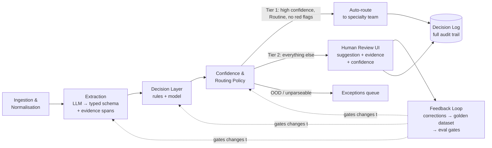

# GP Referral Triage & Routing — System Design

*Preeti Kharb — Staff AI Engineer task, June 2026*

---

## 1. What this system is optimising for

This system has asymmetric failure costs, and the objective function must reflect that before anything else gets designed.

The two ways it can be wrong are not equally bad. A referral routed to the wrong specialty bounces, costs days, and gets corrected — annoying but recoverable. A suspected-cancer referral (Two-Week Wait) wrongly downgraded to Routine sits unexamined in a queue for months, and the error is invisible precisely because nobody re-reads routine queues. One of these failure modes is operational friction; the other is patient harm.

So the objective is a constrained optimisation, not a single metric:

> **Maximise automation coverage — the percentage of letters fully auto-routed with no human touch — subject to two hard constraints: (1) recall on Urgent/2WW within the auto-decided set stays above a very high bar agreed with clinical governance, and (2) the system never autonomously downgrades a priority below what the GP's letter or deterministic red-flag rules indicate.**

I deliberately rejected "maximise accuracy" or "maximise F1" as objectives: any single blended metric averages over exactly the asymmetry that makes this domain dangerous. A model can improve its F1 while getting *worse* on the one error class that matters most.

Precision is not ignored — it's the currency that buys clinical trust. If the system over-escalates, urgent clinics flood with false alarms, genuinely urgent patients compete for the same slots, and clinicians learn that the urgent flag means nothing. A system can be statistically "safe" and still fail socially through alert fatigue. The mechanism that buys both recall and precision simultaneously is **abstention**: the system only decides autonomously where it is confident, and routes everything else to humans. Coverage is then earned gradually as evidence accumulates, rather than promised upfront.

**Explicitly not optimising for:** maximum automation rate, throughput at any cost, or replacing the clinical admin team. The honest goal is to make a small team's judgement go further by concentrating it on the cases that genuinely need it.

## 2. End-to-end architecture

**Ingestion & normalisation.** Letters arrive electronically in inconsistent formats. This stage unifies encoding/format, deduplicates, stamps an immutable audit ID, and applies PII handling appropriate to the deployment context. Entirely deterministic — boring, and load-bearing.

**Extraction.** An LLM converts the unstructured letter into a typed, validated schema (Pydantic or equivalent): presenting symptoms, suspected condition, red-flag indicators, and the GP's stated urgency if any — each as a structured fact with an evidence span. (The POC's `ClinicalSignals` schema implements exactly this: `symptoms`, `red_flags`, `suspected_condition`, `gp_stated_urgency`, plus an `extraction_confidence`.) Every extracted fact must carry an **evidence span** — a pointer to the text that supports it. An extraction that cannot cite its source is discarded. This is the primary structural defence against hallucination: the model is not allowed to "know" things the letter doesn't say.

**Decision layer (hybrid).** Two components with an explicit boundary:
- *Deterministic rules* own the safety floor: red-flag symptom combinations (NICE 2WW referral criteria are published and rule-encodable) force escalation, and the never-downgrade constraint is enforced here, outside the model entirely.
- *The model* (LLM-based classification over the extracted schema; model family is secondary to the architecture) proposes specialty and priority within the space the rules permit.

Rules own hard constraints; the model owns nuance. Each side is independently versioned and can evolve without destabilising the other. The interface between them is the typed schema — a contract, not a vibe.

**Confidence & routing policy.** Each proposed decision carries a calibrated confidence score. Thresholds live in explicit, versioned configuration — per specialty, per priority — not buried in code, so the trust knobs are inspectable and adjustable by non-engineers (including clinical governance). The policy layer routes each letter to one of three outcomes (Section 3).

**Human review & feedback loop.** Reviewers see the AI's suggestion, the highlighted evidence spans, and the confidence — and confirm or correct in one click. Every correction feeds a versioned golden dataset that gates any change to prompts, models, or thresholds: nothing ships if it regresses against the accumulated human judgement.

**Decision log.** Every decision — automated or human — is logged append-only with inputs, extraction output, model version, prompt version, rules fired, confidence, threshold config version, and outcome. Any routing decision is replayable and explainable years later. In a clinical setting this is not a feature; it's a precondition.

*Why extraction is separate from decision (rejected alternative: one LLM call, letter → routing):* a single end-to-end call would be simpler, but it can't ground its answer in evidence spans, can't be tested stage-by-stage, makes failures undiagnosable (was the letter misread, or the decision wrong?), and couples model choice to policy. Separation costs one extra hop and buys auditability, testability, and independent evolution — in this domain, an easy trade.

> **Note on diagrams.** This is the *target* architecture at a conceptual altitude. The POC implements a slice of it; the diagram in `README.md` shows the *implemented* pipeline at a finer grain (pre-filter → extract → classify → safety floor → confidence gate → MVP-scope gate → tier). Same spine, different altitude.

## 3. Where automation ends and human judgment begins

My stance: this problem is **not fully automatable**. The policy layer routes every letter to one of three outcomes (these are the `Tier` values in the code: `AUTO_ROUTE`, `HUMAN_REVIEW`, `EXCEPTION`):

- **Tier 1 — `AUTO_ROUTE` (fully automatic):** confidence above threshold on *both* specialty and priority, **and** the proposed priority is Routine, **and** no red-flag rule fired. These letters route untouched.
- **Tier 2 — `HUMAN_REVIEW` (assisted):** everything that is a real referral but not safe to auto-route — uncertain, ambiguous, red-flag-escalated, or (in the MVP) any Urgent/2WW case. Goes to a human with the suggestion, evidence, and confidence attached. The human decides; the system makes them faster and more consistent.
- **`EXCEPTION` (not a usable referral):** too short, or not a referral at all (e.g. an admin email). Routed to an operational queue for a clerical fix, not a clinical decision. Distinct from Tier 2: the input cannot be triaged, rather than being a referral the system declines to triage alone.

**The never-downgrade constraint cuts across all three.** It is not a tier — it is a hard safety property enforced in the deterministic rules and policy layer (`rules.py` + `policy.py`), outside the model: the system may auto-*escalate* priority but may **never** auto-*downgrade* it below what a red-flag rule or the GP's stated urgency indicates. Downgrading urgency is the one action whose failure mode is silent patient harm, so it is reserved to humans regardless of model confidence — a deliberately conservative choice I would revisit only with substantial deployed evidence and clinical governance sign-off, not with a better model in isolation. In the POC this is why a red flag forces `HUMAN_REVIEW` even when every confidence score is high, and why a GP-stated priority above the model's proposal does the same (the `gp_stated_priority_floor` rule — REF-004 is the worked example: GP-marked urgent, no red flag, model proposed Routine, floor holds it at Urgent for a human).

How I decided where to draw the line: by failure cost, not by model capability. Wherever an error is cheap and visible (specialty routing of routine letters), automation earns its way in early. Wherever an error is expensive and invisible (priority downgrades), the human stays — and the system's job is to make that human's attention count.

## 4. How the system handles uncertainty

"I don't know" has three distinct flavours in production, and they route differently:

1. **Low confidence between known options** ("gastroenterology or general surgery?"). The letter goes to the human queue, ordered by the *worst plausible* priority among the hypotheses, with the competing hypotheses and their evidence shown. Uncertainty about a possibly-urgent letter is treated as urgent.
2. **Out of distribution.** Not actually a referral, illegible transcription, two letters concatenated. The system attempts no classification and routes to an exceptions queue. Trying to be clever on garbage input is how systems hurt people.
3. **Confident but wrong** — the flavour confidence scores cannot see by definition. This is handled outside the pipeline, by the evaluation loop: random blind sampling of auto-routed letters for human audit, calibration monitoring (does 90% confidence mean right 90% of the time?), and drift detection on input distributions. Abstention handles known uncertainty; the eval loop hunts unknown uncertainty.

## 5. MVP

**Assistive triage with zero autonomy — Tier 2 for every letter.** The AI reads, extracts, suggests specialty and priority, highlights its evidence; humans make every decision, faster and more consistently than today. Scope it to the 3–5 highest-volume specialties first: deep evidence in a few pathways beats shallow coverage of all of them, and per-specialty rollout is how trust is earned.

This delivers real value on day one (reviewer speed, consistency across reviewers, urgency-ordered queues) while deliberately deferring the dangerous part. Critically, it does not foreclose the target architecture — every component of the full system is present from day one; the only thing missing is permission. Each human decision silently builds the labelled dataset, agreement statistics, and calibration evidence that later *justify* enabling Tier 1 automation gradually: threshold by threshold, specialty by specialty, starting with high-volume low-risk routine referrals.

The counterargument is that assistive-first delays the efficiency win and the backlog keeps building. I reject it because in a clinical setting the evidence to automate safely *does not exist yet* on day one — shipping automation before the data exists isn't faster, it's just riskier; the assistive phase is how the evidence gets manufactured. The path from MVP to production system is a config change backed by accumulated proof, not a rebuild.

## 6. Failure modes

**Technical:**
- *Hallucinated extraction* — mitigated structurally by evidence spans (uncited facts are discarded), monitored by blind audits.
- *Silent distribution shift* — a new transcription supplier or dictation style changes the input distribution; accuracy decays without any code change. Mitigation: input drift monitors and calibration tracking; honest admission: detection lags damage.
- *Calibration drift* — confidence scores stop meaning what thresholds assume they mean. The policy layer is only as sound as calibration; this is monitored as a first-class metric.
- *Degraded performance on short or poorly-written letters* — likely correlated with deprived areas and non-native-speaker GPs, which makes it an equity issue, not just an accuracy one. Subgroup audits belong in the eval loop from day one.

**Systemic — including one I don't know how to solve:**
- *Automation bias.* Within months, reviewers confronted with mostly-correct AI suggestions start rubber-stamping them, and the human-in-the-loop safety net quietly becomes decorative. Partial mitigations: a random sample of cases shown *without* the AI suggestion, tracking reviewer decision-time and agreement-rate as health metrics, periodic blind audits. I want to be plain: this is managed, not solved, and to my knowledge the industry has not solved it either. Any HITL design that claims otherwise should be distrusted.
- *The backlog moves rather than vanishes.* As automation absorbs easy cases, humans keep only the hard ones; per-case review time rises and the team feels busier, not less busy. This needs expectation-setting with operational leadership, not engineering.
- *Gaming.* GPs learn which phrasings trigger urgent routing. Partially self-correcting via the feedback loop; worth monitoring for phrase-frequency anomalies.

## 7. Scalability vectors

At several hundred letters a day, compute is trivial — this needs a queue and a database, not Kafka, and I'd resist any architecture that implies otherwise. The vectors that actually strain the design are organisational:

- **Specialty growth:** each new specialty multiplies rules, thresholds, and eval coverage to maintain. The mitigation is making policy *data* (versioned config + per-specialty eval suites), never code branches.
- **Multi-site expansion:** different trusts have different local pathways and team structures. The decision made now that prevents pain later: site-specific *policy configuration* over a shared engine — never site-specific forks of the codebase.
- **Human review capacity is the true bottleneck.** If letter volume grows faster than Tier 1 coverage expands, the human queue eats the team. Automation coverage growth must be planned against volume growth explicitly — this, not compute, is the scaling curve that matters.
- **The decision log grows forever by design** — append-only with lifecycle tiering (hot → cold storage); auditability is a retention policy question, not a deletion question.

## 8. Path from MVP to production (phased)

The architecture is constant across every phase — components, contracts, and the audit spine never change. What changes is permission (how much the system may decide alone) and plumbing (how production-hardened each component is). That is deliberate: the expensive thing to retrofit is boundaries, not capacity.

**Hours — the POC (submitted alongside this document).** The core slice on synthetic letters: extraction to a typed schema with evidence spans → red-flag rules + model classification → confidence scoring against threshold config → routing decision, with every decision written to a JSONL log. It exists to prove the three claims the design rests on: evidence-grounded extraction, the rules/model boundary, and abstention.

**Days — pilot-ready demo.** A reviewable queue (minimal UI or CLI), the exceptions path for non-referrals, a seed golden dataset (~100 labelled synthetic letters), an eval harness producing accuracy and calibration reports, and shadow-mode runs against historical letters if available. Output: evidence of how the system *would* have decided, with no patient exposure.

**Weeks — assistive MVP in production.** Real intake integration, PII redaction with the restricted raw zone, the reviewer UI in front of the admin team for the 3–5 pilot specialties, production audit logging, and the three dashboards (operational, AI quality, safety). Zero autonomy; every human decision is building the labelled dataset and reviewer-agreement statistics. Clinical governance engagement starts here, not after.

**Months — earned automation.** With calibration validated against accumulated human decisions: Tier 1 enabled for high-confidence Routine referrals in selected specialties, behind thresholds governance has signed off. Automation-bias countermeasures go live the same day automation does (blind no-suggestion samples, reviewer decision-time and agreement tracking, scheduled audits), alongside drift monitors and subgroup equity audits. Specialty coverage expands one eval suite at a time; multi-site groundwork proceeds as policy configuration, never code forks.

---

*See `ASSUMPTIONS.md` for the load-bearing assumptions log, and `README.md` for the POC.*
