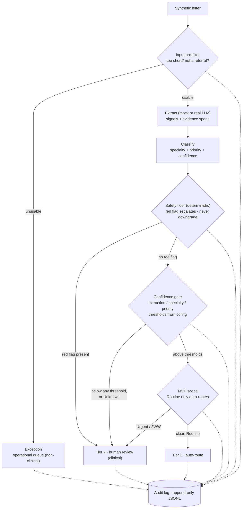

# GP Referral Triage — Proof of Concept

A minimal, deliberately scoped demonstration of the core decision pipeline from the accompanying system design document: **evidence-grounded extraction → deterministic safety rules + model classification → confidence-gated routing**, with every decision written to an audit log.

> **The three deliverables:** [`DESIGN.md`](DESIGN.md) (system design document) · [`ASSUMPTIONS.md`](ASSUMPTIONS.md) (load-bearing assumptions log) · this README + the code (the POC).

This is a toy. It exists to prove three architectural claims, not to triage real referrals:

1. **Evidence-grounded extraction** — every clinical signal the model extracts must cite the span of letter text supporting it; uncited facts are discarded.
2. **An explicit rules/model boundary** — deterministic red-flag rules own the safety floor (forced escalation, never-downgrade); the model proposes specialty and priority only within the space the rules permit.
3. **Abstention** — decisions carry confidence scores checked against versioned threshold config; anything below threshold, or touching a red flag, routes to human review instead of auto-routing.

## Pipeline



The gates run in a deliberate order, and the order encodes the safety stance. The **safety floor** (`rules.py`) runs *first*, before the confidence gate, and is the only gate that can raise priority — it reads config but cannot be *softened* by it. The **confidence gate** is the standard abstention mechanism: extraction, specialty, and priority confidence are each checked against versioned thresholds, and anything below — or any `Unknown` — abstains to human review. The **MVP scope gate** is the last narrowing: even a clean, confident, red-flag-free case only auto-routes if it is Routine. The separation matters because the two mechanisms answer different questions: confidence asks "is the model sure?" (tunable), the safety floor asks "is this dangerous regardless of how sure the model is?" (not tunable). Conflating them — e.g. letting high confidence wave a case past a red flag — is the failure mode the ordering exists to prevent.

**Two kinds of human, two kinds of queue.** *Exception* is not a triage outcome — it means the input is not a usable referral (too short, or an admin email), and it routes to an operational queue where someone chases the missing letter or bounces the misrouted email. *Tier 2 human review* is the clinical queue: a real referral the system will not auto-route because it is uncertain, escalated by a red flag, or outside MVP auto-route scope. Both are logged; nothing is ever silently dropped. The worst case for any input is "a human looks at it", never "the system discards it" — that is what *fail closed* means here.

The model proposes (Extract, Classify); deterministic code disposes (Rules, Gate). Rules run *after* the model and can only escalate or hold priority — never downgrade — so the safety property is structural, not a behaviour the model is trusted to respect.

## Quick start

```bash
python -m venv .venv
source .venv/bin/activate
pip install -r requirements.txt

python scripts/run_triage.py   # runs all 10 synthetic letters, writes audit_log.jsonl
python scripts/run_triage.py --real   # same pipeline, real Claude extraction (see note below)
python scripts/run_triage.py --stats  # adds an observability report (routing mix, distributions)
python scripts/run_eval.py     # scores predictions against gold labels
pytest                         # 59 tests, all passing
```

The default (`mock`) backend is deterministic and offline. The `--real` flag
swaps only the extraction backend for a real Claude call via the structured-
outputs API; it needs an `ANTHROPIC_API_KEY` (copy `.env.example` to `.env`) and
falls back to the mock with a notice if no key is present. See *A real LLM
backend, the coupling it exposed, and the fix* below.

## What you'll see

### run_triage.py

```
ID           Specialty            Priority         Tier           Reason
----------------------------------------------------------------------------------------------------
REF-001      Dermatology          ROUTINE          AUTO_ROUTE     Clean routine referral above all confidence thresholds
REF-002      Dermatology          TWO_WEEK_WAIT    HUMAN_REVIEW   Red flags detected: changing mole, irregular borders, m…
REF-003      Colorectal           TWO_WEEK_WAIT    HUMAN_REVIEW   Red flags detected: rectal bleeding, weight loss. Requi…
REF-004      Gastroenterology     URGENT           HUMAN_REVIEW   GP stated priority URGENT exceeds model proposal ROUTINE.
REF-005      —                    UNKNOWN          EXCEPTION      Input too short to contain a routable referral.
REF-006      —                    UNKNOWN          EXCEPTION      Input does not appear to be a clinical referral.
REF-007      Gastroenterology     URGENT           HUMAN_REVIEW   Red flags detected: weight loss. Requires human review.
REF-008      —                    UNKNOWN          HUMAN_REVIEW   Specialty could not be determined from the referral.
REF-009      Cardiology           URGENT           HUMAN_REVIEW   Red flags detected: chest pain, shortness of breath.
REF-010      Dermatology          ROUTINE          AUTO_ROUTE     Clean routine referral above all confidence thresholds

Total: 10  |  AUTO_ROUTE: 2  |  HUMAN_REVIEW: 6  |  EXCEPTION: 2
```

### run_eval.py

```
=======================================================
EVALUATION REPORT
=======================================================
Routing distribution:
  AUTO_ROUTE         2 / 10  (20%)
  HUMAN_REVIEW       6 / 10  (60%)
  EXCEPTION          2 / 10  (20%)

Accuracy (synthetic labels only):
  Tier accuracy      8/10  (80%)
  Specialty accuracy 6/8   (75%)
  Priority accuracy  7/8   (88%)

⚠️  Safety metrics:
  Unsafe auto-route count          1
  Urgent / 2WW downgrade count     0

Tier mismatches:
  REF-008: tier HUMAN_REVIEW != expected AUTO_ROUTE
  REF-010: tier AUTO_ROUTE != expected HUMAN_REVIEW

Note: numbers reflect the mock pipeline against synthetic labels.
Calibration and clinical validity require a real labelled dataset.
```

The remaining eval gaps are deliberate, not bugs — they show what the keyword mock cannot do, and that the architecture degrades safely when it can't:

**REF-004 — now caught by the GP-stated-priority floor.** The GP marked the referral urgent and mentioned weight loss, but the extractor correctly suppressed the hedged weight loss ("may be related to reduced appetite") and the mock classifier proposed Routine. Previously this auto-routed — a silent downgrade of the GP's stated urgency, the exact failure the design forbids. The policy gate now reads `gp_stated_priority` as a floor the model may never drop below, so REF-004 routes to HUMAN_REVIEW at URGENT with `gp_stated_priority_floor` in `rules_fired`. This is why the Urgent/2WW downgrade count is 0.

**REF-010 (the one remaining unsafe auto-route):** A borderline "likely eczema" referral where the GP expressed uncertainty. The mock produced high specialty and priority confidence because it pattern-matched on "rash". A calibrated real model would express lower confidence and send this to HUMAN_REVIEW. Calibration measurement — does 0.9 confidence mean right 90% of the time? — is the biggest gap between this POC and something trustworthy. The eval flags it honestly rather than hiding it.

**REF-008 (over-escalated to human review):** The mock couldn't distinguish "stable angina, routine follow-up" from "new cardiac symptoms," so it abstained (Unknown specialty) and the case went to human review. A real LLM reads clinical context; the mock reads keywords. This is over-caution, not a safety violation — the safe direction.

Every decision is appended to `audit_log.jsonl` with: letter ID, extracted signals + evidence spans, rules fired, model proposal, confidence, threshold config version, and final routing.

## A real LLM backend, the coupling it exposed, and the fix

`extract.py` ships two interchangeable backends behind the same `ClinicalSignals`
schema: the deterministic mock (default) and a real Claude call via the
structured-outputs API (`--real`). The real backend is constrained to the same
Pydantic output schema the mock produces, so the model cannot free-text its way
around the contract.

Running `--real` first proved the structural claim, then exposed a real coupling
bug — which was the more useful result, and which is now fixed:

- **The schema contract held.** Swapping the backend changed nothing structurally.
  Valid `ClinicalSignals` flowed through rules, policy, audit, and routing with
  no code changes and no crashes. The interface did its job.
- **The real extractor is genuinely better at extraction.** It caught unexplained
  rectal bleeding and new shortness of breath with grounded evidence spans, and
  suppressed negated and hedged findings — things the keyword mock can only
  approximate.
- **But initially most specialties came back `Unknown` → HUMAN_REVIEW.** Not an
  LLM failure: `classify.py` did exact-string matching on the symptom *values*
  the mock happens to emit (`"skin tag"`). The LLM writes richer phrasings
  (`"benign skin tag on the right forearm"`), which the literal match missed.

**The lesson, and the fix.** A typed schema guarantees *shape*, not *value
semantics*. The classifier was implicitly coupled to the mock extractor's exact
vocabulary, not just to the `ClinicalSignals` type. The fix is `canonicalize.py`:
a thin controlled-vocabulary layer between extraction and classification that
maps whatever free text an extractor produces onto a fixed set of terms the
classifier keys off. Evidence text is preserved verbatim so the audit trail
still shows the extractor's original wording. With it in place, valid
`ClinicalSignals` from either backend route through the same path; the mock's
distribution is 2 auto / 6 review / 2 exception. (The real LLM is sampled, so on
genuinely borderline letters it can land differently run to run — always toward
human review, never toward an unsafe auto-route, which is the direction the
architecture guarantees.) In production this seam is where a clinical terminology
service (SNOMED CT) would sit; isolating it to one module means that swap stays local.

Writing the fix also caught a bug *in the fix*: a naive substring map sent
"lower GI" to Gastroenterology because the bare token "gi" matched first. The
canonicalisation test suite pinned the correct mapping and forced word-specific
variants — a small reminder that controlled vocabularies are themselves
error-prone and need their own tests.

The original failure was safe in direction: every misclassification fell to
HUMAN_REVIEW, never to an unsafe auto-route. The system degraded toward caution,
which is the behaviour the architecture is designed to guarantee.

## Scalability vectors

Where this design strains as it grows, and which current choices help or hurt:

**Volume (hundreds → thousands of letters/day).** The pipeline is a stateless
per-letter function, so horizontal scale is a queue-and-worker problem, not a
redesign — the brief is right that a 500/day trust does not need Kafka; a simple
queue with a worker pool suffices, and the audit log is already append-only so
concurrent writers need only an append-safe sink (managed log store or per-worker
shards merged downstream). The real cost ceiling under `--real` is the LLM call
per letter; prompt caching, batching, and a cheap first-pass model that escalates
only uncertain letters to a stronger model are the levers.

**Specialties (5 → all).** This is where the current design strains first. The
classifier and the controlled vocabulary are hand-authored; every new specialty
is new mapping logic and new red-flag rules. That does not scale by editing
dictionaries forever. The path is to move classification to a model trained on
labelled referrals and keep only the *safety* rules hand-authored — the red-flag
floor stays deterministic and small even as specialties multiply, because
suspected-cancer pathways are a bounded set, while specialty routing is open-ended.
The canonicalisation seam is what makes that migration local.

**Sites (one trust → many).** Routing policy and thresholds are already config,
not code, so per-site variation is config authoring rather than re-architecture —
local pathways, local specialty taxonomies, local thresholds. What does *not*
scale for free is evaluation: each site needs its own labelled set and its own
calibration, because triage norms differ. The constraint we accept now is a
single threshold file and a single eval set; the multi-site version needs
per-site config namespaces and per-site eval suites, which the versioned-config
design anticipates but does not yet implement.

**The decision that constrains us most.** Hand-authored classification logic is
the deliberate MVP shortcut that will need replacing first. It is cheap and fully
auditable at 5 specialties; it becomes the bottleneck at 30. The architecture is
built so that swap is contained — model behind the `Proposal` contract,
vocabulary behind `canonicalize.py`, safety behind `rules.py` — but the swap is
inevitable and is the first thing on the post-MVP roadmap.

## Repository structure

```
referral-triage-poc/
├── scripts/
│   ├── run_triage.py            # CLI entry point (--real, --stats)
│   └── run_eval.py              # Accuracy and safety metrics
├── src/triage/
│   ├── schemas.py               # Typed Pydantic contracts incl. evidence spans
│   ├── extract.py               # Extraction — mock (keyword + negation) or real LLM
│   ├── canonicalize.py          # Controlled-vocab layer between extract and classify
│   ├── classify.py              # Specialty + priority proposal with confidence
│   ├── rules.py                 # Red-flag rules, never-downgrade enforcement
│   ├── policy.py                # Pre-filter + gates → Tier 1 / Tier 2 / Exception
│   ├── metrics.py               # Observability surface (routing mix, distributions)
│   ├── audit.py                 # JSONL decision log
│   └── pipeline.py              # Wires the stages: extract → canonicalize → classify → policy → audit
├── config/
│   └── thresholds.yaml          # Routing thresholds — policy as config, not code
├── data/
│   └── synthetic_letters.json   # 10 synthetic letters with gold labels
└── tests/
    ├── test_rules.py            # 28 tests — safety floor tested first
    ├── test_policy.py           # 23 tests — written before policy.py
    └── test_canonicalize.py     #  8 tests — controlled-vocab mapping
```

## Design decisions worth noticing

**The mock model is a feature, not a shortcut.** The model sits behind the schema contract (`ClinicalSignals → Proposal`); swapping mock for real changes nothing downstream. The modularity claim is demonstrated, not asserted.

**Thresholds live in `config/thresholds.yaml`**, versioned and referenced in every audit record. The audit stamp reads the version string from the file at runtime — there is no hardcoded default that could silently disagree with the loaded config.

**`rules.py` runs after classification and can only escalate or hold.** The model physically cannot downgrade past the rules. The safety property is structural.

**Two independent priority floors, each with its own audit reason.** The red-flag floor (from the letter's clinical content) and the GP-stated-priority floor (from `gp_stated_priority`) are different sources of the same constraint — a lower bound the model may never drop below. They run before the confidence gates and report distinct rules (`red_flag_detected:*` vs `gp_stated_priority_floor`), so the audit trail says *why* a case escalated rather than blurring the two. REF-004 is the GP-floor's worked example.

**The safety floor is tested first.** `tests/test_rules.py` was committed before `rules.py` existed. The never-downgrade guarantee had to exist as a failing test before a single line of implementation.

**`Priority` carries a numeric `.rank` property.** All priority comparisons use ordinal severity (`a.rank >= b.rank`), never string comparison. This is enforced by the test suite.

**`AuditRecord` version fields have no defaults.** `audit.py` must pass `pipeline_version`, `ruleset_version`, and `threshold_version` explicitly. A missing version fails loudly rather than silently stamping a stale value.

**A controlled-vocabulary layer (`canonicalize.py`) sits between extraction and classification.** It maps free-text symptom and specialty strings onto a fixed vocabulary, so the classifier depends on a known value-set rather than on whatever exact wording a given extractor happens to emit. This is what lets the mock and real-LLM backends produce identical routing. Evidence text is preserved verbatim for the audit trail. **Red flags use a *separate* vocabulary whose canonical names are exactly the ones `rules.py` owns** — so canonicalisation can never rename a red flag to a token the safety floor doesn't recognise. (An earlier single-vocabulary version collapsed "changing mole" → "mole"; "mole" is not a 2WW flag name, so the red-flag priority floor silently dropped from Two-Week Wait to Routine. Splitting the vocabularies, pinned by tests, is the fix.)

## What this deliberately does NOT do

- No real patient data — all letters are synthetic, invented for this POC
- No PII redaction, no restricted raw zone (designed in the system design doc; out of scope here)
- No human review UI — the review queue is a logged destination, not an interface
- No production infrastructure — no queues, no services, no deployment; a single CLI process
- No calibration measurement — thresholds are asserted starting values, not derived from a labelled holdout set. Calibration is the single biggest gap between this POC and something trustworthy
- No claim of clinical validity — red-flag rules are illustrative simplifications

Each of these has a designed home in the full architecture; their absence here is scoping, not oversight.

## With more time

- **Calibration measurement** — does 0.9 confidence mean right 90% of the time on a labelled set? The thresholds are asserted, not validated.
- **A golden dataset** (~100 labelled letters) and an eval harness gating any prompt or rule change.
- **GP urgency as a classifier *feature*** — the never-downgrade-below-GP guarantee is now enforced in the policy gate (`gp_stated_priority_floor`, the REF-004 fix), so the GP's stated urgency can raise priority and block auto-route but never lower it. What's still missing is the *classifier* using `gp_stated_urgency` as an input to its proposal — it should inform the model's specialty/priority reasoning, not just act as a post-hoc floor.
- **Replace hand-authored classification with a trained model** — the controlled vocabulary and rule-based classifier are the deliberate MVP shortcut; see *Scalability vectors*.
- **Property-based tests on `policy.py`** — the routing function is where silent failures would hide.
- **Reviewer-facing rendering of evidence spans** — the audit log stores them; the interface doesn't exist yet.

---
*Companion to the system design document and assumptions log submitted alongside.*
