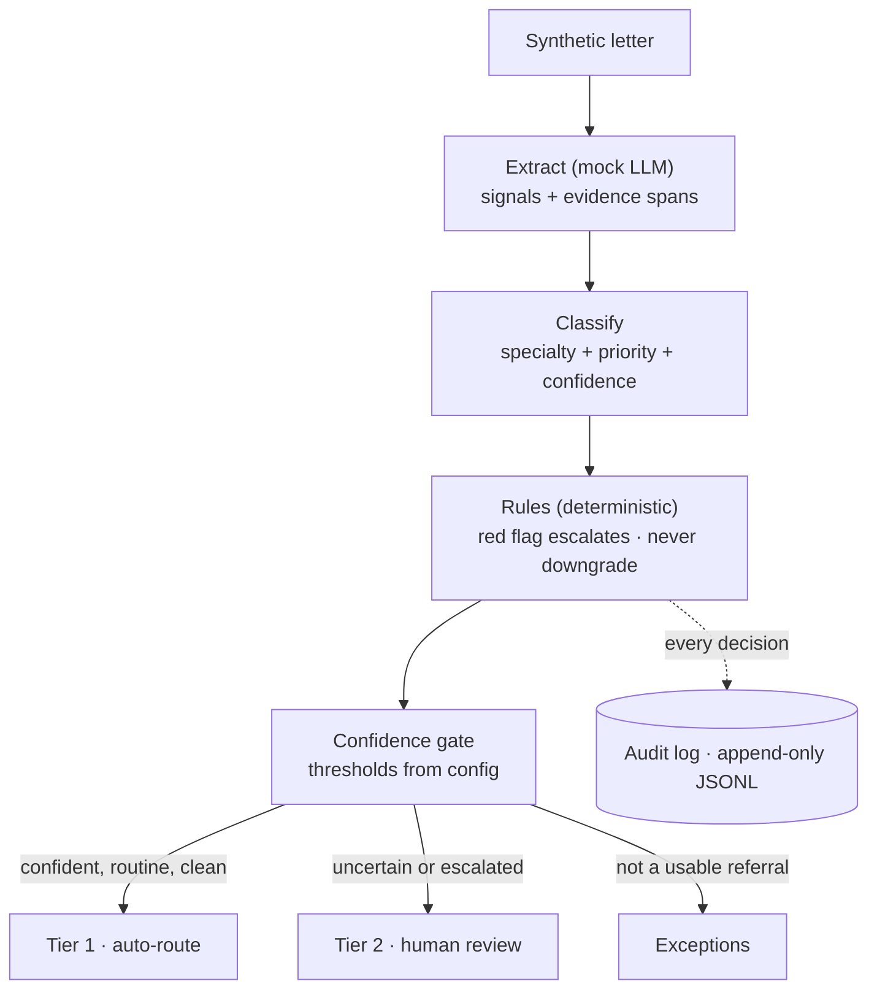

# GP Referral Triage — Proof of Concept

A minimal, deliberately scoped demonstration of the core decision pipeline from the accompanying system design document: **evidence-grounded extraction → deterministic safety rules + model classification → confidence-gated routing**, with every decision written to an audit log.

This is a toy. It exists to prove three architectural claims, not to triage real referrals:

1. **Evidence-grounded extraction** — every clinical signal the model extracts must cite the span of letter text supporting it; uncited facts are discarded.
2. **An explicit rules/model boundary** — deterministic red-flag rules own the safety floor (forced escalation, never-downgrade); the model proposes specialty and priority only within the space the rules permit.
3. **Abstention** — decisions carry confidence scores checked against versioned threshold config; anything below threshold, or touching a red flag, routes to human review instead of auto-routing.

## Pipeline



The model proposes (Extract, Classify); deterministic code disposes (Rules, Gate). Rules run *after* the model and can only escalate or hold priority — never downgrade — so the safety property is structural, not a behaviour the model is trusted to respect.

## Quick start

```bash
python -m venv .venv
source .venv/bin/activate
pip install -r requirements.txt

python scripts/run_triage.py   # runs all 10 synthetic letters, writes audit_log.jsonl
python scripts/run_eval.py     # scores predictions against gold labels
pytest                         # 51 tests, all passing
```

## What you'll see

### run_triage.py

```
ID           Specialty            Priority         Tier           Reason
----------------------------------------------------------------------------------------------------
REF-001      Dermatology          ROUTINE          AUTO_ROUTE     Clean routine referral above all confidence thresholds
REF-002      Dermatology          TWO_WEEK_WAIT    HUMAN_REVIEW   Red flags detected: changing mole, irregular borders, m…
REF-003      Colorectal           TWO_WEEK_WAIT    HUMAN_REVIEW   Red flags detected: rectal bleeding, weight loss. Requi…
REF-004      Gastroenterology     ROUTINE          AUTO_ROUTE     Clean routine referral above all confidence thresholds
REF-005      —                    UNKNOWN          EXCEPTION      Input too short to contain a routable referral.
REF-006      —                    UNKNOWN          EXCEPTION      Input does not appear to be a clinical referral.
REF-007      Gastroenterology     URGENT           HUMAN_REVIEW   Priority confidence 0.78 below threshold 0.8.
REF-008      —                    UNKNOWN          HUMAN_REVIEW   Specialty could not be determined from the referral.
REF-009      Cardiology           URGENT           HUMAN_REVIEW   Red flags detected: chest pain, shortness of breath.
REF-010      Dermatology          ROUTINE          AUTO_ROUTE     Clean routine referral above all confidence thresholds

Total: 10  |  AUTO_ROUTE: 3  |  HUMAN_REVIEW: 5  |  EXCEPTION: 2
```

### run_eval.py

```
=======================================================
EVALUATION REPORT
=======================================================
Routing distribution:
  AUTO_ROUTE         3 / 10  (30%)
  HUMAN_REVIEW       5 / 10  (50%)
  EXCEPTION          2 / 10  (20%)

Accuracy (synthetic labels only):
  Tier accuracy      7/10  (70%)
  Specialty accuracy 6/8   (75%)
  Priority accuracy  6/8   (75%)

⚠️  Safety metrics:
  Unsafe auto-route count          2
  Urgent / 2WW downgrade count     1

Tier mismatches:
  REF-004: tier AUTO_ROUTE != expected HUMAN_REVIEW
  REF-008: tier HUMAN_REVIEW != expected AUTO_ROUTE
  REF-010: tier AUTO_ROUTE != expected HUMAN_REVIEW

Note: numbers reflect the mock pipeline against synthetic labels.
Calibration and clinical validity require a real labelled dataset.
```

The safety violations in the eval output are the intended result, not a bug. They surface two failure modes the mock cannot solve:

**REF-004 (unsafe auto-route):** The GP explicitly marked the referral "urgent" and mentioned weight loss, but the extractor correctly suppressed hedged weight loss ("may be related to reduced appetite") and the mock classifier has no way to read the GP's urgency declaration. A real LLM would catch both. The eval detects the miss; the fix is a better extractor, not a different architecture.

**REF-010 (unsafe auto-route):** A borderline "likely eczema" referral where the GP expressed uncertainty. The mock produced high specialty and priority confidence because it pattern-matched on "rash". A calibrated real model would express lower confidence and send this to HUMAN_REVIEW. Calibration measurement — does 0.9 confidence mean right 90% of the time? — is the biggest gap between this POC and something trustworthy.

**REF-008 (over-escalated to human review):** The mock couldn't distinguish "stable angina, routine follow-up" from "new cardiac symptoms." A real LLM reads clinical context; the mock reads keywords.

Every decision is appended to `audit_log.jsonl` with: letter ID, extracted signals + evidence spans, rules fired, model proposal, confidence, threshold config version, and final routing.

## Repository structure

```
referral-triage-poc/
├── scripts/
│   ├── run_triage.py            # CLI entry point
│   └── run_eval.py              # Accuracy and safety metrics
├── src/triage/
│   ├── schemas.py               # Typed Pydantic contracts incl. evidence spans
│   ├── extract.py               # Extraction (mock — keyword matching with negation)
│   ├── classify.py              # Specialty + priority proposal with confidence
│   ├── rules.py                 # Red-flag rules, never-downgrade enforcement
│   ├── policy.py                # Threshold check → Tier 1 / Tier 2 / Exception
│   ├── audit.py                 # JSONL decision log
│   └── pipeline.py              # Wires the four stages
├── config/
│   └── thresholds.yaml          # Routing thresholds — policy as config, not code
├── data/
│   └── synthetic_letters.json   # 10 synthetic letters with gold labels
└── tests/
    ├── test_rules.py            # 28 tests — safety floor tested first
    └── test_policy.py           # 23 tests — written before policy.py
```

## Design decisions worth noticing

**The mock model is a feature, not a shortcut.** The model sits behind the schema contract (`ClinicalSignals → Proposal`); swapping mock for real changes nothing downstream. The modularity claim is demonstrated, not asserted.

**Thresholds live in `config/thresholds.yaml`**, versioned and referenced in every audit record. The audit stamp reads the version string from the file at runtime — there is no hardcoded default that could silently disagree with the loaded config.

**`rules.py` runs after classification and can only escalate or hold.** The model physically cannot downgrade past the rules. The safety property is structural.

**The safety floor is tested first.** `tests/test_rules.py` was committed before `rules.py` existed. The never-downgrade guarantee had to exist as a failing test before a single line of implementation.

**`Priority` carries a numeric `.rank` property.** All priority comparisons use ordinal severity (`a.rank >= b.rank`), never string comparison. This is enforced by the test suite.

**`AuditRecord` version fields have no defaults.** `audit.py` must pass `pipeline_version`, `ruleset_version`, and `threshold_version` explicitly. A missing version fails loudly rather than silently stamping a stale value.

## What this deliberately does NOT do

- No real patient data — all letters are synthetic, invented for this POC
- No PII redaction, no restricted raw zone (designed in the system design doc; out of scope here)
- No human review UI — the review queue is a logged destination, not an interface
- No production infrastructure — no queues, no services, no deployment; a single CLI process
- No calibration measurement — thresholds are asserted starting values, not derived from a labelled holdout set. Calibration is the single biggest gap between this POC and something trustworthy
- No claim of clinical validity — red-flag rules are illustrative simplifications

Each of these has a designed home in the full architecture; their absence here is scoping, not oversight.

## With more time

- **Calibration measurement** — does 0.9 confidence mean right 90% of the time on a labelled set? The thresholds are asserted, not validated.
- **A golden dataset** (~100 labelled letters) and an eval harness gating any prompt or rule change.
- **GP urgency signal in the classifier** — `gp_stated_urgency` is extracted but the mock classifier ignores it. REF-004 is the failure case.
- **Property-based tests on `policy.py`** — the routing function is where silent failures would hide.
- **Reviewer-facing rendering of evidence spans** — the audit log stores them; the interface doesn't exist yet.

---
*Companion to the system design document and assumptions log submitted alongside.*
